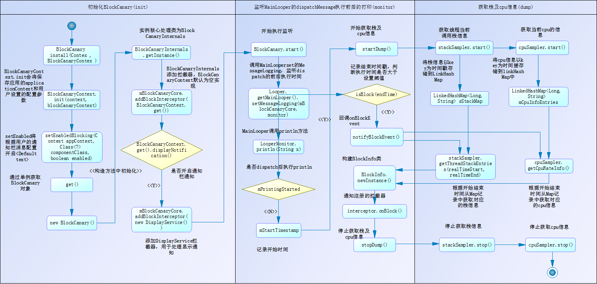

# blockcanary核心执行流程是怎样？

blockcanary的核心原理是通过自定义一个Printer，设置到主线程ActivityThread的MainLooper中。MainLooper在dispatch消息前后都会调用Printer进行打印。从而获取前后执行的时间差值，判断是否超过设置的阈值。如果超过，则会将记录的栈信息及cpu信息发通知到前台。

## 类说明：

- BlockCanary
  外观类，提供初始化及开始、停止监听
- BlockCanaryContext
  配置上下文，可配置id、当前网络信息、卡顿阈值、log保存路径等
- BlockCanaryInternals
  blockcanary核心的调度类，内部包含了monitor（设置到MainLooper的printer）、stackSampler（栈信息处理器）、cpuSampler（cpu信息处理器）、mInterceptorChain（注册的拦截器）、以及onBlockEvent的回调及拦截器的分发
- LooperMonitor
  继承了Printer接口，用于设置到MainLooper中。通过复写println的方法来获取MainLooper的dispatch前后的执行时间差，并控制stackSampler和cpuSampler的信息采集。
- StackSampler
  用于获取线程的栈信息，将采集的栈信息存储到一个以key为时间戳的LinkHashMap中。通过mCurrentThread.getStackTrace()获取当前线程的StackTraceElement
- CpuSampler
  用于获取cpu信息，将采集的cpu信息存储到一个以key为时间戳的LinkHashMap中。通过读取/proc/stat文件获取cpu的信息
- DisplayService
  继承了BlockInterceptor拦截器，onBlock回调会触发发送前台通知
- DisplayActivity
  用于显示记录的异常信息Activity

leakcanary的核心流程主要包含3个步骤。

1. init-初始化
2. monitor-监听MainLooper的dispatch时间差，推送前台通知
3. dump-采集线程栈信息及cpu信息

## blockcanary是如何进行卡顿的判定？

blockcanary的核心原理是通过自定义一个Printer，设置到主线程ActivityThread的MainLooper中。MainLooper在dispatch消息前后都会调用Printer进行打印。从而获取前后执行的时间差值，判断是否超过设置的阈值。如果超过，则判定为卡顿。

## blockcanary是如何获取线程的堆栈信息？

通过mCurrentThread.getStackTrace()方法，遍历获取StackTraceElement，转化为一个StringBuilder的value，并存储到一个key为时间戳的LinkHashMap中。

## blockcanary是如何获取cpu的信息？

通过读取/proc/stat文件，获取所有CPU活动的信息来计算CPU使用率。解析出信息后，转化为一个StringBuilder的value，并存储到一个key为时间戳的LinkHashMap中。

## 总结 思考

blockcanary充分的利用了Loop的机制，在MainLooper的loop方法中执行dispatchMessage前后都会执行printer的println进行输出，并且提供了方法设置printer。通过分析前后打印的时差与阈值进行比对，从而判定是否卡顿。
